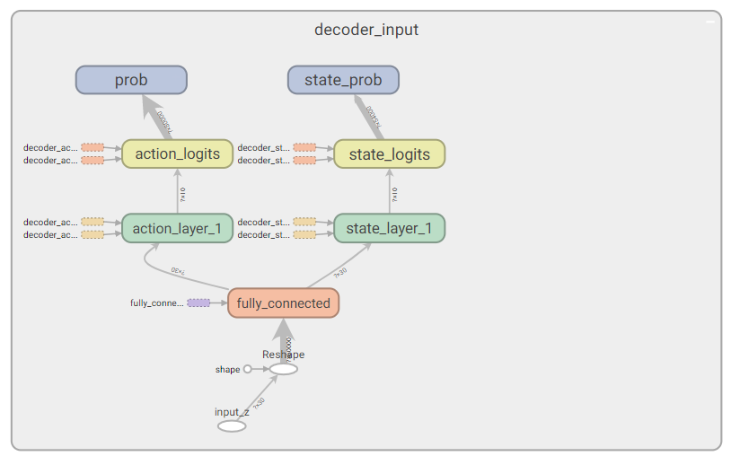
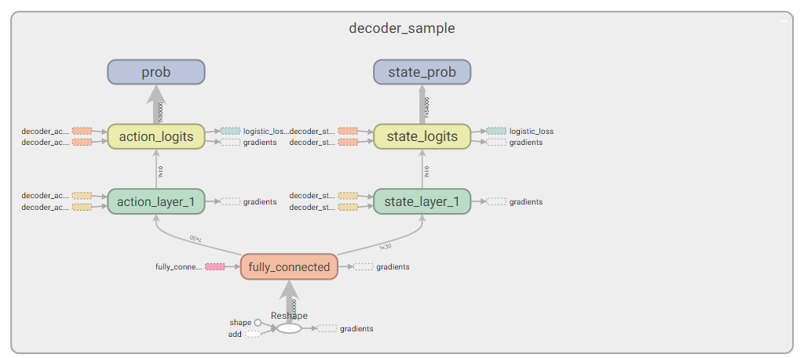
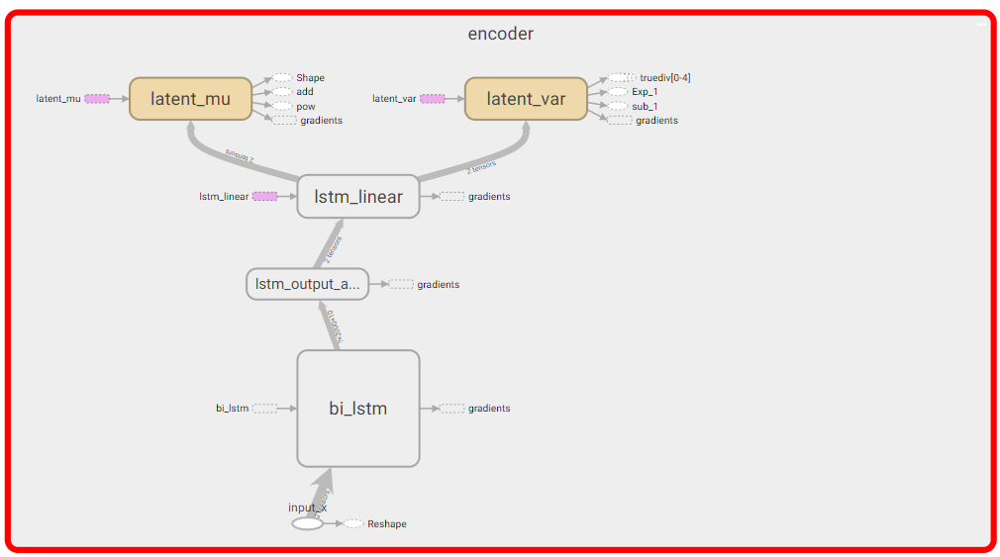
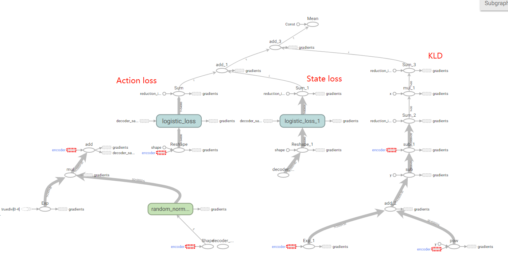

## 实现VAE

### 网络结构(参考论文‘Roubust Imitation of Divserse Behaviours’)

现有资源train 不动原文网络，将原网络中的wavenet替换成mlp

* Decoder input (latent space -> mlp -> action net  + state net)

* Decoder sample

  

* Encoder (bi lstm + mlp -> $\mu$ + $\sigma​$ )

  

* Loss数据流

  